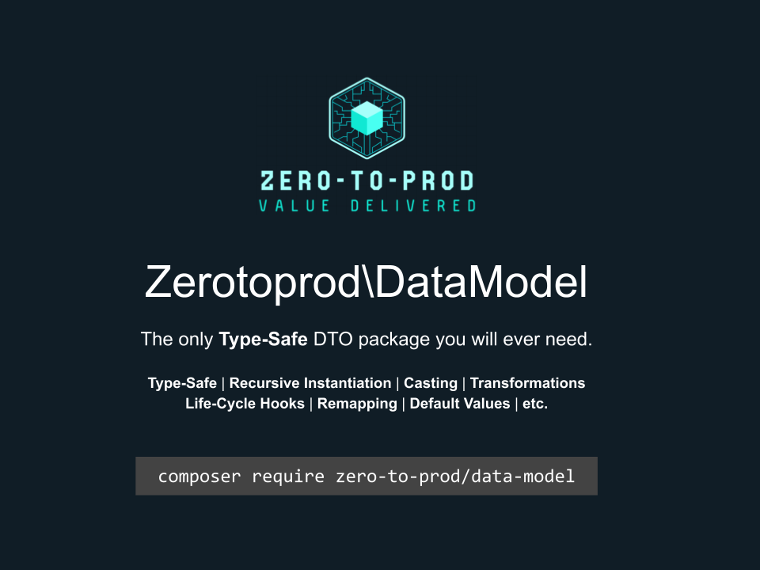

# Zerotoprod\DataModel



[](https://github.com/zero-to-prod/data-model)
[](https://github.com/zero-to-prod/data-model/actions)
[](https://packagist.org/packages/zero-to-prod/data-model/stats)
[](https://packagist.org/packages/zero-to-prod/data-model/stats)
[](https://packagist.org/packages/zero-to-prod/data-model)
[](https://github.com/zero-to-prod/data-model/blob/main/LICENSE.md)

A `DataModel` provides a lightweight, non-invasive way to hydrate type-safe PHP objects recursively.

### Why Use DataModel?

- **Simplify Object Hydration**: No more manual assignment of properties or repetitive boilerplate code. A `DataModel` automates the process, 
ensuring your objects are populated correctly based on their type declarations.
- **Ensure Type Safety**: Type safety is enforced by PHP itself. With a `DataModel`, you can trust that your objects contain the expected types without 
extra validation.
- **Reduce Defensive Programming**: Instead of writing defensive code to check and sanitize your data, a `DataModel` allows you to define how each property 
should be resolved before the object is hydrated.
- **Flexible Value Resolution**: With the `#[Describe()]` attribute, you control how values are resolved for each property, including transformations, 
default values, and custom casting. This ensures that your data model behaves exactly as you intend.
- **Non-Invasive Integration**: Simply add the `DataModel` trait to your classes. There’s no need to extend base classes or implement interfaces, keeping 
your class hierarchy clean.

## Features

- [Type-Safe](#recursive-hydration): Type-safety is enforced by the PHP language itself. No need to validate a type.
- [Non-Invasive](#hydrating-from-data): Simply add the DataModel trait to a class. No need to extend, implement, or construct.
- [Recursive Instantiation](#recursive-hydration): Recursively instantiate classes based on their type.
- [Type Casting](#property-level-cast): Supports primitives, custom classes, enums, and more.
- [Life-Cycle Hooks](#life-cycle-hooks): Run methods before and after a value is resolved with [pre](#pre-hook) and [post](#post-hook).
- [Transformations](#transformations): Describe how to resolve a value before instantiation.
- [Required Properties](#required-properties): Throw an exception when a property is not set.
- [Default Values](#default-values): Set a default property value.
- [Nullable Missing Values](#nullable-missing-values): Resolve a missing value as null.
- [Remapping](#re-mapping): Re-map a key to a property of a different name.
- [Ignoring Properties](#ignoring-properties): Ignore a resolving a property.

## Examples

- [Array of DataModels](#array-of-datamodels)
- [Collection of DataModels](#collection-of-datamodels)
- [Laravel Validation](#laravel-validation)

### How It Works

At its core, a `DataModel` uses reflection and PHP attributes to hydrate your objects. When you use the `from()` method, it recursively instantiates 
classes based on their type hints, resolving values according to the rules you define.

By using the `#[Describe()]` attribute, you can specify:

- **Transformations**: Define how to convert input data before assigning it to a property.
- **Life-Cycle Hooks**: Run methods before and after a value is resolved.
- **Default Values** and Required Properties: Ensure properties have sensible defaults or enforce their presence.
- **Type Casting**: Handle primitives, custom classes, enums, and more.

This approach allows you to centralize value resolution upstream of your business logic, drastically reducing downstream checks.

### Better Than Defensive Programming

Traditional defensive programming requires you to scatter validation and type-checking throughout your code, leading to verbosity and potential
oversights. With a **DataModel**, you define value resolution logic once, using the `#[Describe()]` attribute.

This method reduces boilerplate, minimizes the risk of missing checks, and results in cleaner, more readable code. It shifts the focus from defensive
checks to declarative definitions, improving both development speed and code quality.

## Showcase
Projects that use DataModels:
- [DataModels for OpenAPI 3.0.*](https://github.com/zero-to-prod/data-model-openapi30)
- [DataModels for the Envoyer API.](https://github.com/zero-to-prod/data-model-envoyer)

## Installation

You can install the package via Composer:

```bash
composer require zero-to-prod/data-model
```

### Additional Packages

- [DataModelHelper](https://github.com/zero-to-prod/data-model-helper): Helpers for a `DataModel`.
- [DataModelFactory](https://github.com/zero-to-prod/data-model-factory): A factory helper to set the value of your `DataModel`.
- [Transformable](https://github.com/zero-to-prod/transformable): Transform a `DataModel` into different types.

## Usage

Use the `DataModel` trait in a class.

```php
class User
{
    use \Zerotoprod\DataModel\DataModel;

    public string $name;
    public int $age;
}
```

### Hydrating from Data

Use the `from` method to instantiate your class, passing an associative array or object.

```php
$User = User::from([
    'name' => 'John Doe',
    'age' => '30',
]);
echo $User->name; // 'John Doe'
echo $User->age; // 30
```

### Recursive Hydration

A `DataModel` recursively instantiates classes based on their type declarations.
If a property’s type hint is a class, its value is passed to that class’s `from()` method.

In this example, the `address` element is automatically converted into an `Address` object,
allowing direct access to its properties: `$User->address->city`.

```php
class Address
{
    use \Zerotoprod\DataModel\DataModel;

    public string $street;
    public string $city;
}

class User
{
    use \Zerotoprod\DataModel\DataModel;

    public string $username;
    public Address $address;
}

$User = User::from([
    'username' => 'John Doe',
    'address' => [
        'street' => '123 Main St',
        'city' => 'Hometown',
    ],
]);

echo $User->address->city; // Outputs: Hometown
```

## Transformations

A `DataModel` provides a variety of ways to transform data before the value is assigned to a property.

The `Describe` attribute provides a declarative way describe how property values are resolved.

### Describe Attribute

Resolve a value by adding the `Describe` attribute to a property.

The `Describe` attribute can accept these arguments.

```php
#[\Zerotoprod\DataModel\Describe([
    'ignore' // ignores a property
    // Re-map a key to a property of a different name
    'from' => 'key', 
    // Runs before 'cast'
    'pre' => [MyClass::class, 'preHook']
    // Targets the static method: `MyClass::methodName()`
    'cast' => [MyClass::class, 'castMethod'], 
    // 'cast' => 'my_func', // alternately target a function
    // Runs after 'cast' passing the resolved value as `$value`
    'post' => [MyClass::class, 'postHook']
    'default' => 'value',
    'required', // Throws an exception if the element is missing
    'missing_as_null', // sets the value to null if the element is missing
])]
```

### Order of Precedence

There is an order of precedence when resolving a value for a property.

1. [Property-level Cast](#property-level-cast)
2. [Method-level Cast](#method-level-cast)
3. [Union Types](#union-types)
4. [Class-level Casts](#class-level-cast)
5. Types that have a **concrete** static method `from()`.
6. Native Types

### Property-Level Cast

The using the `Describe` attribute directly on the property takes the highest precedence.

```php
use Zerotoprod\DataModel\Describe;

class User
{
    use \Zerotoprod\DataModel\DataModel;

    #[Describe(['cast' => [self::class, 'firstName'], 'function' => 'strtoupper'])]
    public string $first_name;
    
    #[Describe(['cast' => 'uppercase'])]
    public string $last_name;

    #[Describe(['cast' => [self::class, 'fullName']])]
    public string $full_name;

    private static function firstName(mixed $value, array $context, ?\ReflectionAttribute $ReflectionAttribute, \ReflectionProperty $ReflectionProperty): string
    {
        return $ReflectionAttribute->getArguments()[0]['function']($value);
    }

    public static function fullName(mixed $value, array $context, ?\ReflectionAttribute $Attribute, \ReflectionProperty $Property): string
    {
        return "{$context['first_name']} {$context['last_name']}";
    }
}

function uppercase(mixed $value, array $context){
    return strtoupper($value);
}

$User = User::from([
    'first_name' => 'Jane',
    'last_name' => 'Doe',
]);

$User->first_name;  // 'JANE'
$User->last_name;   // 'DOE'
$User->full_name;   // 'Jane Doe'
```

#### Life-Cycle Hooks

You can run methods before and after a value is resolved.

#### `pre` Hook

You can use `pre` to run a `void` method before the value is resolved.

```php
use Zerotoprod\DataModel\Describe;

class BaseClass
{
    use \Zerotoprod\DataModel\DataModel;

    #[Describe(['pre' => [self::class, 'pre'], 'message' => 'Value too large.'])]
    public int $int;

    public static function pre(mixed $value, array $context, ?\ReflectionAttribute $Attribute, \ReflectionProperty $Property): void
    {
        if ($value > 10) {
            throw new \RuntimeException($Attribute->getArguments()[0]['message']);
        }
    }
}
```

#### `post` Hook

You can use `post` to run a `void` method after the value is resolved.

```php
use Zerotoprod\DataModel\Describe;

class BaseClass
{
    use \Zerotoprod\DataModel\DataModel;

    public const int = 'int';

    #[Describe(['post' => [self::class, 'post'], 'message' => 'Value too large.'])]
    public int $int;

    public static function post(mixed $value, array $context, ?\ReflectionAttribute $Attribute, \ReflectionProperty $Property): void
    {
        if ($value > 10) {
            throw new \RuntimeException($value.$Attribute->getArguments()[0]['message']);
        }
    }
}
```

### Method-level Cast

Use the `Describe` attribute to resolve values with class methods. Methods receive `$value` and `$context` as parameters.

```php
use Zerotoprod\DataModel\Describe;

class User
{
    use \Zerotoprod\DataModel\DataModel;

    public string $first_name;
    public string $last_name;
    public string $fullName;

    #[Describe('last_name')]
    public function lastName(mixed $value, array $context, ?\ReflectionAttribute $Attribute, \ReflectionProperty $Property): string
    {
        return strtoupper($value);
    }

    #[Describe('fullName')]
    public function fullName(mixed $value, array $context, ?\ReflectionAttribute $Attribute, \ReflectionProperty $Property): string
    {
        return "{$context['first_name']} {$context['last_name']}";
    }
}

$User = User::from([
    'first_name' => 'Jane',
    'last_name' => 'Doe',
]);

$User->first_name;  // 'Jane'
$User->last_name;   // 'DOE'
$User->fullName;    // 'Jane Doe'
```

### Union Types

A value passed to property with a union type is directly assigned to the property.
If you wish to resolve the value in a specific way, use a [class method](#method-level-cast).

### Class-Level Cast

You can define how to resolve different types at the class level.

```php
use Zerotoprod\DataModel\Describe;

function uppercase(mixed $value, array $context){
    return strtoupper($value);
}

#[Describe([
    'cast' => [
        'string' => 'uppercase',
        \DateTimeImmutable::class => [self::class, 'toDateTimeImmutable'],
    ]
])]
class User
{
    use \Zerotoprod\DataModel\DataModel;

    public string $first_name;
    public DateTimeImmutable $registered;

    public static function toDateTimeImmutable(mixed $value, array $context): DateTimeImmutable
    {
        return new DateTimeImmutable($value);
    }
}

$User = User::from([
    'first_name' => 'Jane',
    'registered' => '2015-10-04 17:24:43.000000',
]);

$User->first_name;              // 'JANE'
$User->registered->format('l'); // 'Sunday'
```

## Required Properties

Enforce that certain properties are required using the Describe attribute:

```php
use Zerotoprod\DataModel\Describe;

class User
{
    use \Zerotoprod\DataModel\DataModel;

    #[Describe(['required' => true])]
    public string $username;

    public string $email;
}

User::from(['email' => 'john@example.com']);
// Throws PropertyRequiredException exception: Property: username is required
```

## Default Values

You can set a default value for a property like this:

```php
use Zerotoprod\DataModel\Describe;

class User
{
    use \Zerotoprod\DataModel\DataModel;

    #[Describe(['default' => 'N/A'])]
    public string $username;
}

$User = User::from();

echo $User->username // 'N/A'
```

### Limitations

Note that using `null` as a default will not work: `#[Describe(['default' => null])]`.

Use `#[Describe(['missing_as_null' => true])]` to set a null value.

## Nullable Missing Values

Set missing values to null by setting `missing_as_null => true`. This can be placed at the class or property level.

This prevents an Error when attempting to assess a property that has not been initialized.
> Error: Typed property User::$age must not be accessed before initialization

```php
use Zerotoprod\DataModel\Describe;

#[Describe(['missing_as_null' => true])]
class User
{
    use \Zerotoprod\DataModel\DataModel;

    public ?string $name;
    
    #[Describe(['missing_as_null' => true])]
    public ?int $age;
}

$User = User::from();

echo $User->name; // null
echo $User->age;  // null
```

### Limitations

Note that using `null` as a default will not work: `#[Describe(['default' => null])]`.

Use `#[Describe(['missing_as_null' => true])]` to set a null value.

## Re-Mapping

You can map a key to a property of a different name like this:

```php
use Zerotoprod\DataModel\Describe;

class User
{
    use \Zerotoprod\DataModel\DataModel;

    #[Describe(['from' => 'firstName'])]
    public string $first_name;
}

$User = User::from([
    'firstName' => 'John',
]);

echo $User->first_name; // John
```

## Ignoring Properties

You can ignore a property like this:

```php
use Zerotoprod\DataModel\Describe;

class User
{
    use \Zerotoprod\DataModel\DataModel;

    public string $name;

    #[Describe(['ignore' => true])]
    public int $age;
}
```

```php
use Zerotoprod\DataModel\Describe;

class User
{
    use \Zerotoprod\DataModel\DataModel;

    #[Describe(['from' => 'firstName'])]
    public string $first_name;
}

$User = User::from([
    'name' => 'John Doe',
    'age' => '30',
]);

isset($User->age); // false
```

## Examples

### Array of DataModels

This examples uses the [DataModelHelper](https://github.com/zero-to-prod/data-model-helper).

```bash
composer require zero-to-prod/data-model-helper
```

```php
use Zerotoprod\DataModel\Describe;

class User
{
    use \Zerotoprod\DataModel\DataModel;
    use \Zerotoprod\DataModelHelper\DataModelHelper;
    
    /** @var Alias[] $Aliases */
    #[Describe([
        'cast' => [self::class, 'mapOf'],   // Use the mapOf helper method
        'type' => Alias::class,             // Target type for each item
    ])]
    public array $Aliases;
}

class Alias
{
    use \Zerotoprod\DataModel\DataModel;
    
    public string $name;
}

$User = User::from([
    'Aliases' => [
        ['name' => 'John Doe'],
        ['name' => 'John Smith'],
    ]
]);

echo $User->Aliases[0]->name; // Outputs: John Doe
echo $User->Aliases[1]->name; // Outputs: John Smith
```

### Collection of DataModels

This examples uses the [DataModelHelper](https://github.com/zero-to-prod/data-model-helper)
and [Laravel Collections](https://github.com/illuminate/collections).

```bash
composer require zero-to-prod/data-model-helper
composer require illuminate/collections
```

```php
use Zerotoprod\DataModel\Describe;

class User
{
    use \Zerotoprod\DataModel\DataModel;
    use \Zerotoprod\DataModelHelper\DataModelHelper;
    
    /** @var Collection<int, Alias> $Aliases */
    #[Describe([
        'cast' => [self::class, 'mapOf'],
        'type' => Alias::class,
    ])]
    public \Illuminate\Support\Collection $Aliases;
}

class Alias
{
    use \Zerotoprod\DataModel\DataModel;
    
    public string $name;
}

$User = User::from([
    'Aliases' => [
        ['name' => 'John Doe'],
        ['name' => 'John Smith'],
    ]
]);

echo $User->Aliases->first()->name; // Outputs: John Doe
```

### Laravel Validation

By leveraging the `pre` life-cycle hook, you run a validator before a value is resolved.

```php
use Illuminate\Support\Facades\Validator;
use Zerotoprod\DataModel\Describe;

readonly class FullName
{
    use \Zerotoprod\DataModel\DataModel;

    #[Describe([
        'pre' => [self::class, 'validate'],
        'rule' => 'min:2'
    ])]
    public string $first_name;

    public static function validate(mixed $value, array $context, ?\ReflectionAttribute $Attribute): void
    {
        $validator = Validator::make(['value' => $value], ['value' => $Attribute?->getArguments()[0]['rule']]);
        if ($validator->fails()) {
            throw new \RuntimeException($validator->errors()->toJson());
        }
    }
}
```

## Testing

```shell
./vendor/bin/phpunit
```
